# Quantum Scattering

This repository is a numerical investigation of one-dimensional scattering from a symmetric double-barrier potential. I used the same potential in several different calculations—stationary scattering, time-dependent wave packets, a finite-box basis, and complex scaling—to see how the description of a resonance changes from one method to another.

The main result is simple: the potential supports two low-energy resonances. They appear as sharp peaks in the transmission curve, as temporary trapping in the time-dependent calculation, as localized positive-energy states in a large box, and finally as complex poles after coordinate rotation. The interesting part is that all four pictures point to the same physics.

## Model

Natural units are used throughout, with \(\hbar=m=1\). The Hamiltonian is

$$
H=-\frac{1}{2}\frac{d^2}{dx^2}+V(x),
\qquad
V(x)=\left(\frac{x^2}{2}-0.8\right)e^{-0.1x^2}.
$$

The potential has a central well and two barriers near \(x=\pm\sqrt{11.6}\). Their height is about 1.57, so the low-energy states in the well are not truly bound: they can leak into the continuum by tunnelling.

The two resonances found from the stationary calculation are:

| Resonance | Transmission peak | Complex-scaled pole | Width \(\Gamma=-2\operatorname{Im}E\) |
|---|---:|---:|---:|
| First | 0.62097030 | \(0.620971-0.000058i\) | 0.000116 |
| Second | 1.32882395 | \(1.327197-0.015447i\) | 0.030894 |

The first resonance is extremely narrow. The second has a much larger width and therefore a noticeably shorter lifetime.

## 1. Stationary scattering

For a fixed energy, a transmitted plane wave is imposed on the right of the potential and the Schrödinger equation is propagated backwards across a uniform grid. Matching the result to incoming and reflected waves on the left gives the amplitudes \(A(E)\), \(B(E)\), and therefore

$$
T(E)=\frac{1}{|A(E)|^2},
\qquad
R(E)=\frac{|B(E)|^2}{|A(E)|^2}.
$$

The calculation uses \(x\in[-50,50]\) and \(\Delta x=0.0025\). A broad energy scan first locates the resonances; each peak is then refined on a much denser local grid.

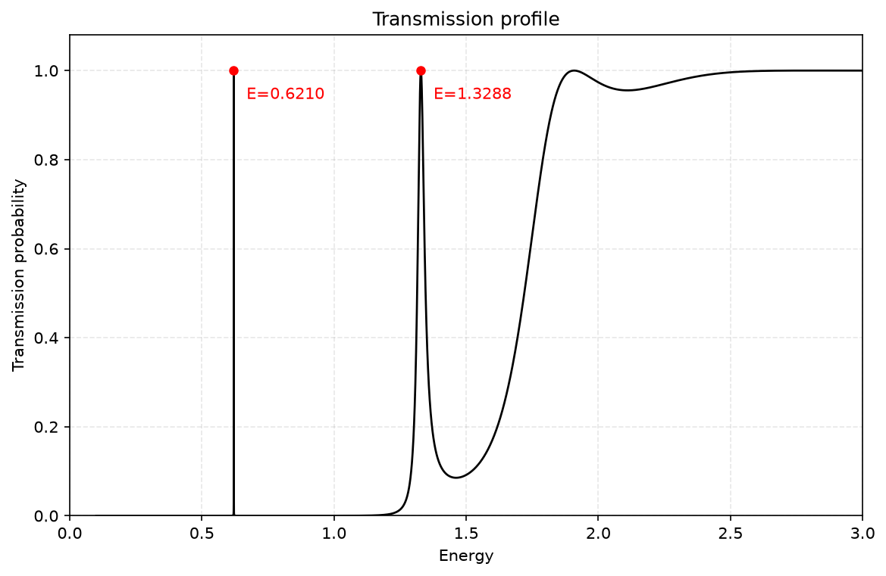

Most energies below the barrier height are strongly reflected. At the two resonant energies, however, the wave in the central well matches a quasi-bound mode and the transmission rises to almost one. The first peak is so narrow that it is easy to miss on a coarse scan; the second is broad enough to remain visible in the full transmission curve.

The wave functions on either side of each peak are included in [`results/part3_stationary_scattering`](results/part3_stationary_scattering). Off resonance, the left side contains a large reflected component. At the peak, the reflected amplitude nearly vanishes and the wave has a much larger amplitude inside the well.

## 2. Time-dependent wave packets

A stationary transmission curve tells us which energies pass through the potential, but it does not show the process in real space. To make that visible, the scattering eigenstates are combined with Gaussian momentum weights and evolved with their phase factor \(e^{-iEt}\).

Three packets were chosen to sample different parts of the transmission curve:

| Case | Energy range | What it tests |
|---|---:|---|
| Mostly reflected | 0.8–1.2 | Below the barrier and away from a transmission peak |
| Partially transmitted | around 1.3288 | A packet wide enough to contain both resonant and off-resonant components |
| Mostly transmitted | 2.5–2.9 | An energy band above the barrier |

| Mostly reflected | Partially transmitted | Mostly transmitted |
|---|---|---|
| 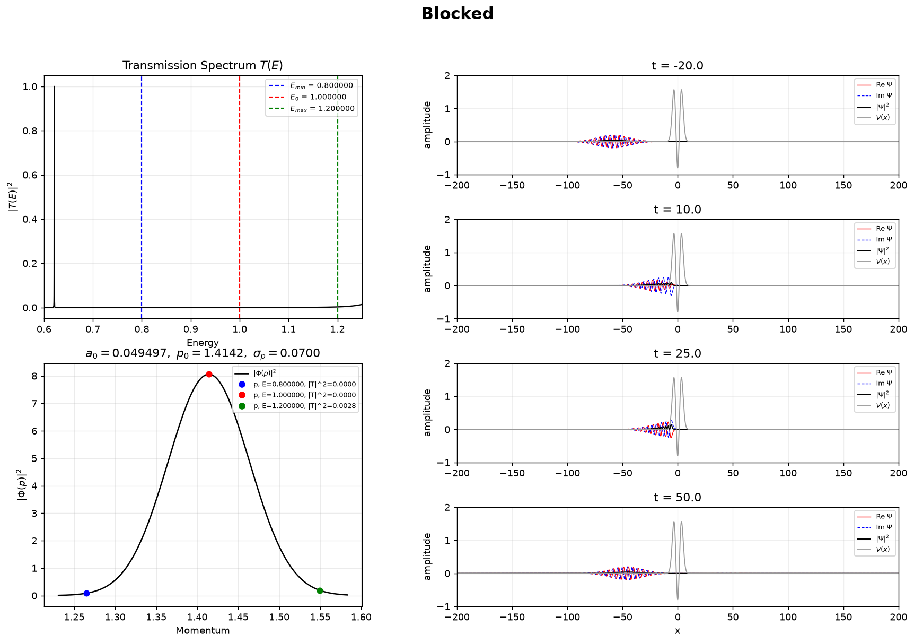 | 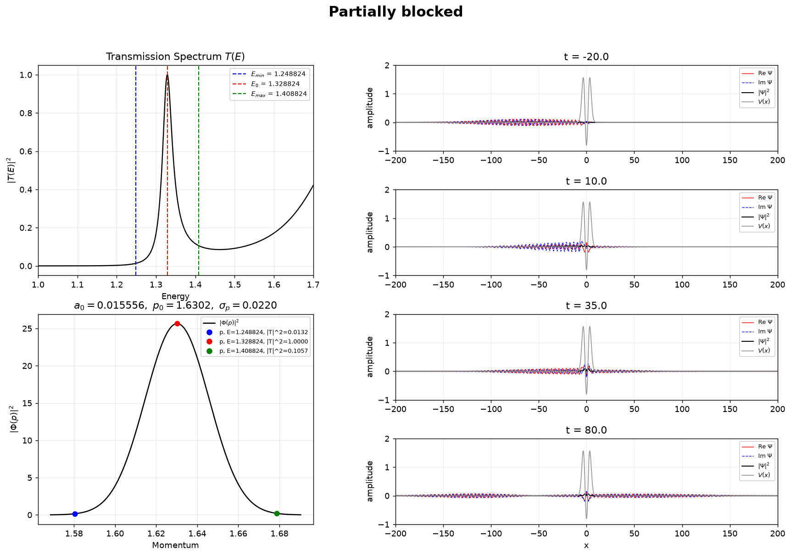 | 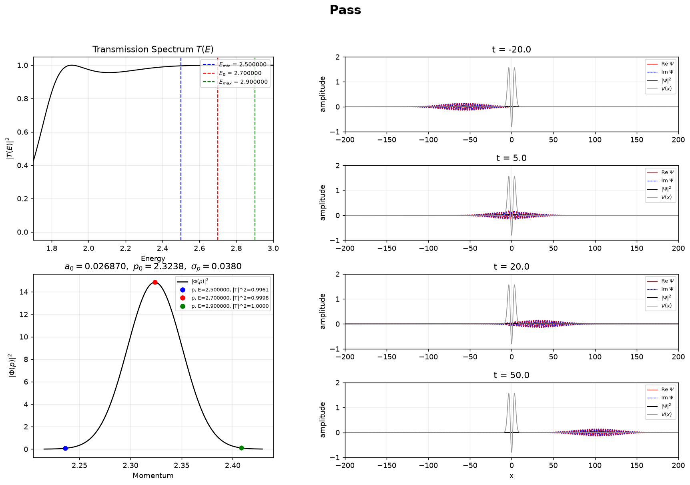 |

The reflected packet reverses direction after reaching the barrier. The middle packet separates into two pieces because different momentum components see very different transmission probabilities. The high-energy packet crosses the interaction region with only a small reflected tail.

### Animations

The animations are more useful than the snapshots for seeing when the packet occupies the central well. The shaded potential is fixed; the moving curve is the probability density.

| Reflection | Partial transmission | Transmission |
|---|---|---|
| 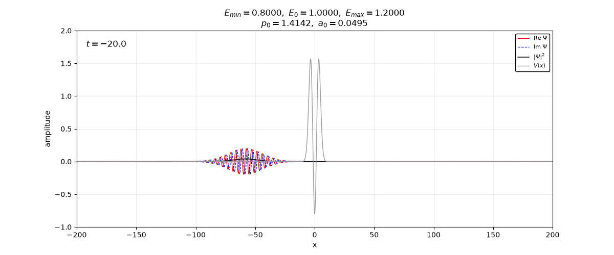 | 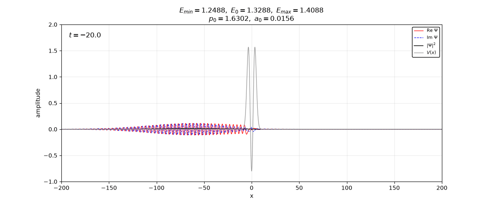 | 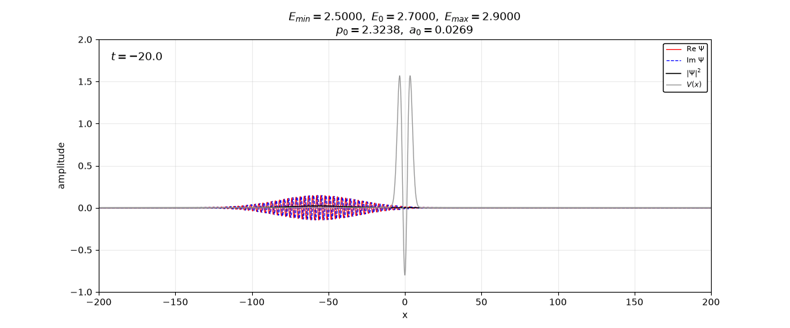 |

Packets centred very tightly on the two resonances behave differently from the broad examples above. The first resonance requires an exceptionally narrow energy window. That narrow width corresponds to a long-lived state, so the packet has to travel over a much larger distance and time scale before the full scattering process becomes visible. The second resonance decays much faster.

| First resonance | Second resonance |
|---|---|
| 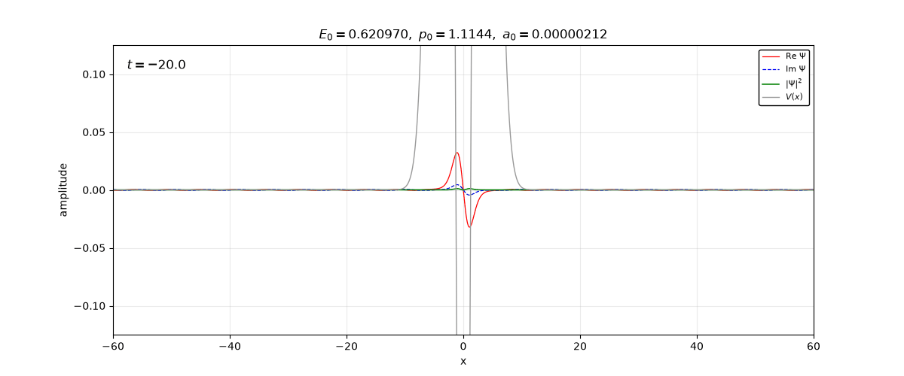 | 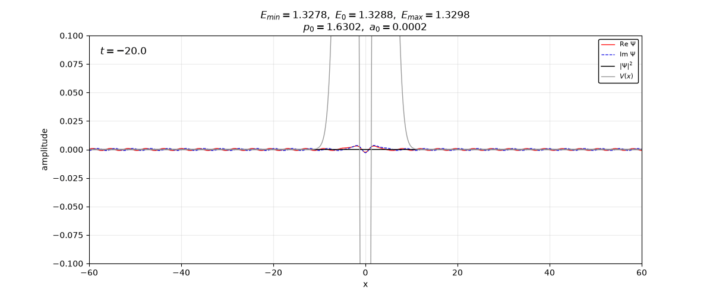 |

The full-range versions are also available as [`first_resonance_full.gif`](results/part4_wavepacket_scattering/first_resonance_full.gif) and [`second_resonance_full.gif`](results/part4_wavepacket_scattering/second_resonance_full.gif).

## 3. Checks before the scattering calculation

Two smaller calculations were used to check conventions and numerical resolution before solving the double-barrier problem.

### Free Gaussian propagation

For a free particle, every momentum component keeps its magnitude and acquires the phase \(e^{-ip^2t/2}\). The packet centre moves at the group velocity while the envelope spreads. Reproducing both effects is a useful check of the Fourier normalization and time-dependent phase convention.

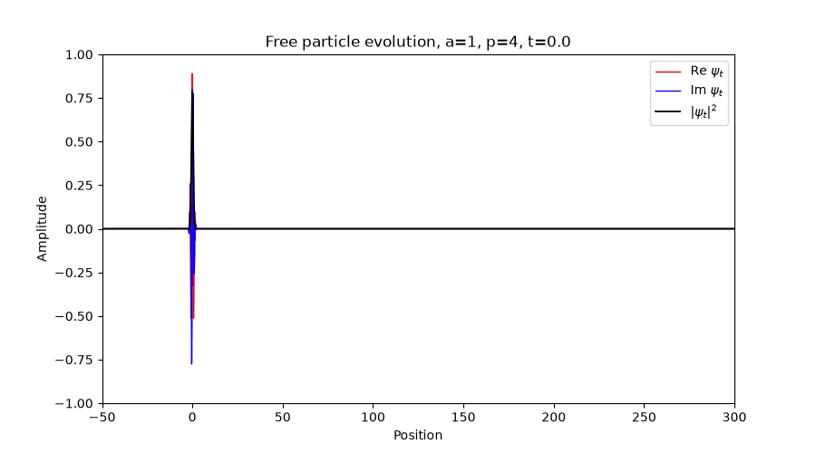

The accompanying figures compare different initial widths and mean momenta in [`results/part1_free_gaussian`](results/part1_free_gaussian).

### Regularized delta function

The finite-cutoff representation

$$
\delta_L(p)=\frac{\sin(Lp)}{\pi p}
$$

becomes taller and more oscillatory as \(L\) increases. Instead of judging convergence only by its shape, the code integrates it against a smooth test function and compares the result with \(f(0)\). The integration grid is tied to the shortest sinc oscillation, which avoids aliasing at large \(L\).

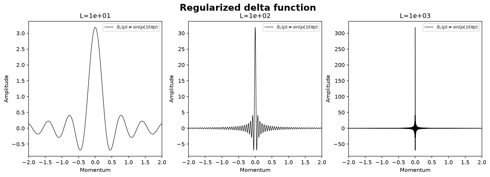

The numerical values for \(L=10,100,1000\) are saved in [`delta_convergence.csv`](results/part2_regularized_delta/delta_convergence.csv).

## 4. Finite-box basis

The Hamiltonian is also diagonalized in a particle-in-a-box sine basis. I first checked the matrix construction against a shifted harmonic oscillator, whose low-lying spectrum is known. The same basis was then applied to the short-range double-barrier potential.

Putting a continuum problem in a finite box turns the continuum into a dense set of discrete states. Most of those states extend across the entire box, but a few have unusually large weight in the interaction region. One is the negative-energy bound state; the other two lie close to the stationary resonance energies.

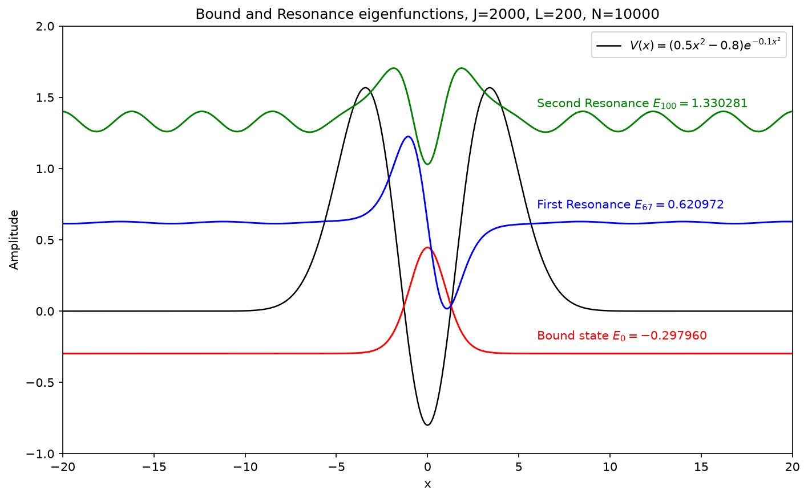

These positive-energy box states are not true bound states—their energies move when the box is changed—but their localization makes the connection with the quasi-bound modes of the central well clear. The harmonic-oscillator validation and the wider box spectra are in [`results/part5_box_basis`](results/part5_box_basis).

## 5. Complex scaling and resonance poles

The finite-box calculation still represents a resonance using real eigenvalues. Complex scaling exposes its energy and lifetime directly by rotating the coordinate,

$$
x\rightarrow xe^{i\theta},
\qquad
H(\theta)=e^{-2i\theta}T+V(xe^{i\theta}).
$$

As \(\theta\) increases, continuum eigenvalues rotate into the lower half of the complex-energy plane. Resonance poles remain comparatively stable and separate from those rotating branches.

| Complex spectra for several angles | Transmission reconstructed from the poles |
|---|---|
| 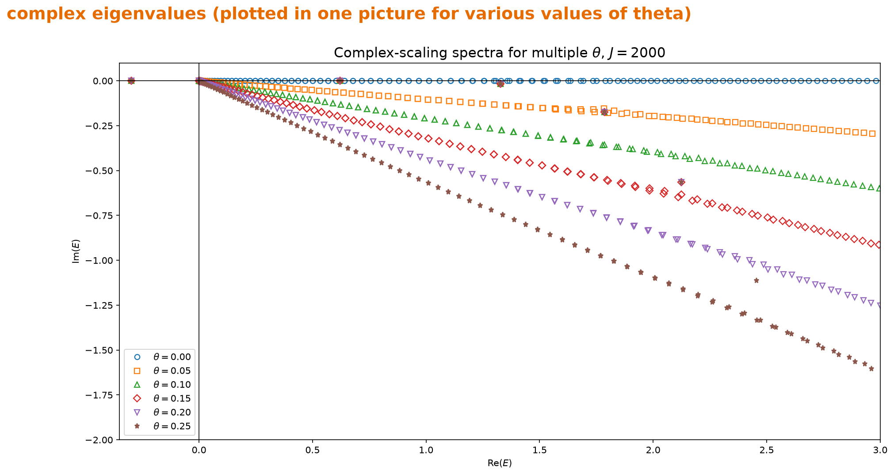 | 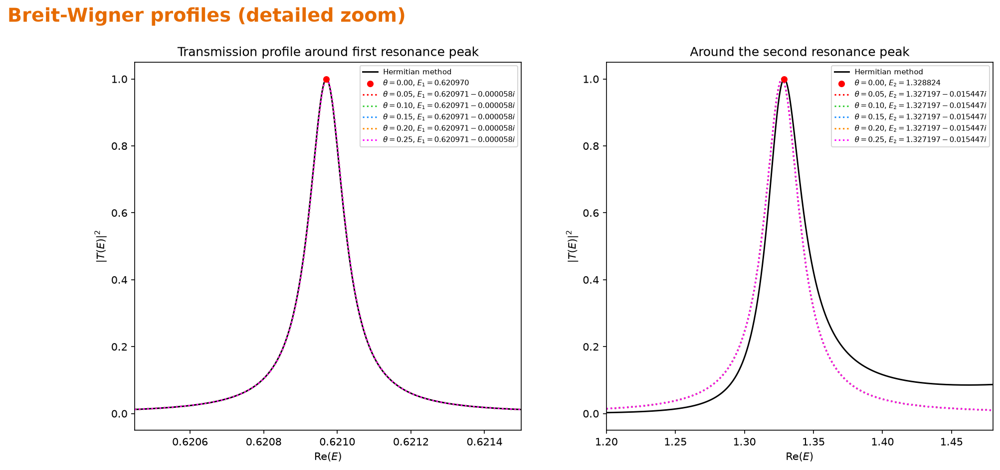 |

Writing a pole as \(E_\mathrm{pole}=E_r-i\Gamma/2\), its real part gives the resonance position and \(\Gamma\) gives the width. A Breit–Wigner curve built from each pole reproduces the corresponding finite-difference peak near resonance. The agreement is especially clear for the narrow first peak; the broader second peak also shows more influence from the non-resonant background.

The resonance wave-function plots illustrate why the coordinate rotation is useful. The outgoing solution grows on the real axis and is not square-integrable. Along the rotated coordinate it decays, which allows the resonance to be represented with an ordinary basis calculation.

## Numerical workflow

| Part | Method | Main output |
|---|---|---|
| 1 | Analytic/Fourier Gaussian propagation | Packet spreading and motion |
| 2 | Oscillatory quadrature | Convergence of \(\delta_L\) against a test function |
| 3 | Three-point finite-difference propagation | \(T(E)\), \(R(E)\), and resonant continuum states |
| 4 | Superposition of scattering states | Time-dependent reflection and tunnelling |
| 5 | Sine-basis diagonalization | Bound and localized box states |
| 6 | Complex-scaled Hamiltonian | Resonance poles, widths, and Breit–Wigner profiles |

## Running the code

Python 3.10 or later is recommended.

```bash
python -m pip install -e .
quantum-scattering all --profile quick --output-dir output
```

`quick` is intended for a short test run. The figures committed to this repository use the larger `reference` settings, including a 2000-state basis for the complex-scaling calculation. GIF generation can be skipped when only static figures are needed:

```bash
quantum-scattering all --profile quick --skip-gifs --output-dir output
```

Each part can also be run separately:

```bash
python scripts/part3.py --output-dir output
python scripts/part4.py --profile quick --skip-gifs --output-dir output
python scripts/part6.py --profile quick --output-dir output
```

## Repository structure

```text
quantum-scattering/
├── src/quantum_scattering/   # Numerical methods and plotting functions
├── scripts/                  # One entry point for each calculation
├── results/                  # Selected figures, animations, and numerical data
├── report/                   # Full derivation and discussion
├── pyproject.toml
└── README.md
```

The longer derivation, parameter choices, and discussion are in [`report/quantum_scattering_report.docx`](report/quantum_scattering_report.docx). A related reference on extracting resonance information is [arXiv:2204.03651](https://arxiv.org/abs/2204.03651).
